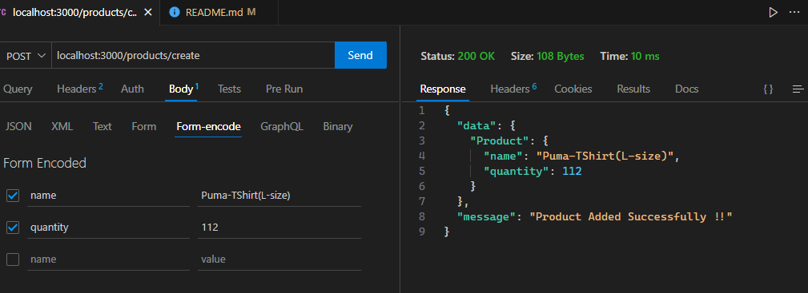
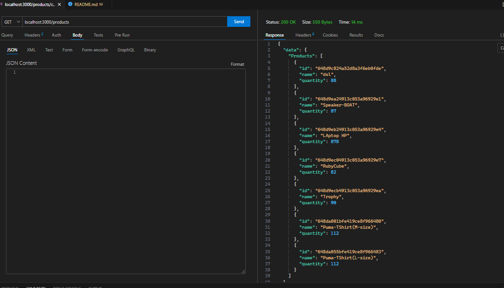
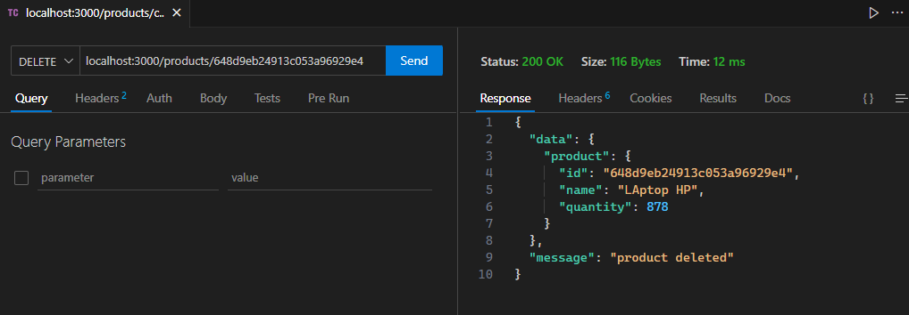
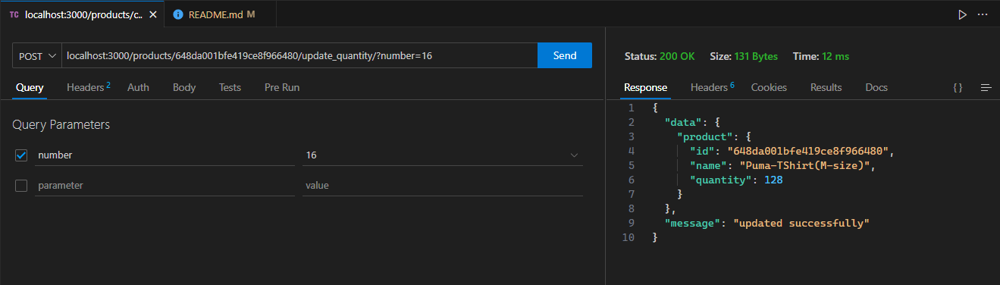

# Ecommerce_API
This is a major project based on Back-End knowledge , Level 01 Project

Ecommerce API
LEVEL 1
 Go to Terminal
1st => npm install

2nd=>  move ECOMMERCE_API FOLDER  then "npm start "

localhost:3000/ 

-	Design an API for an ecommerce platform admin to manage product inventory
-	Tech Stack: Node.js & Mongo DB
-	[HINT] :: Test your API’s using Postman , I have used here Thunder Client {VS code extension}
-	Beginner Level
-	Models/Schemas:
-	Products [fields: id, name, quantity]
-	API to add products to the database
URL [POST]: localhost:3000/products/create

-	API to list products
URL [GET] : localhost:3000/products

-	API to delete products
URL [DELETE] : localhost:3000/products/:id

-	API to update quantity of a product (can be incremented or decremented)
URL [POST] : localhost:3000/products/:id/update_quantity/?number=10

